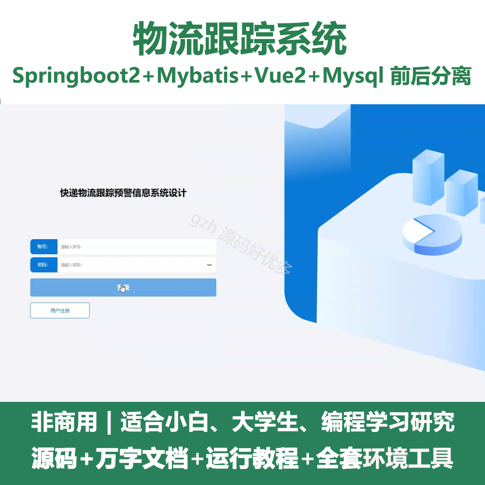
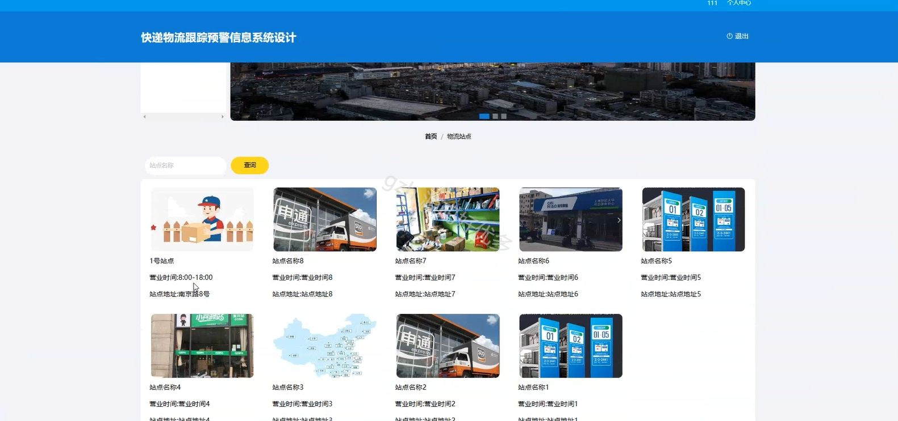
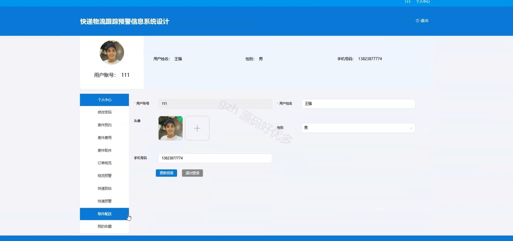
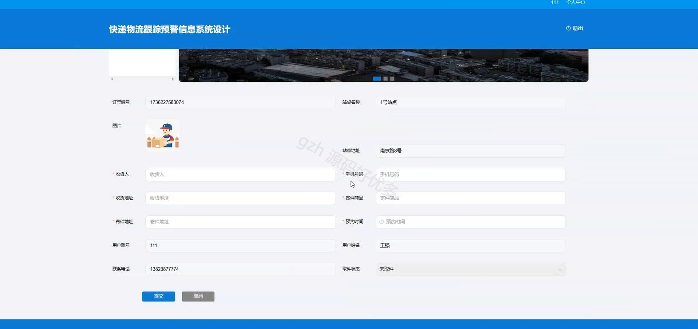
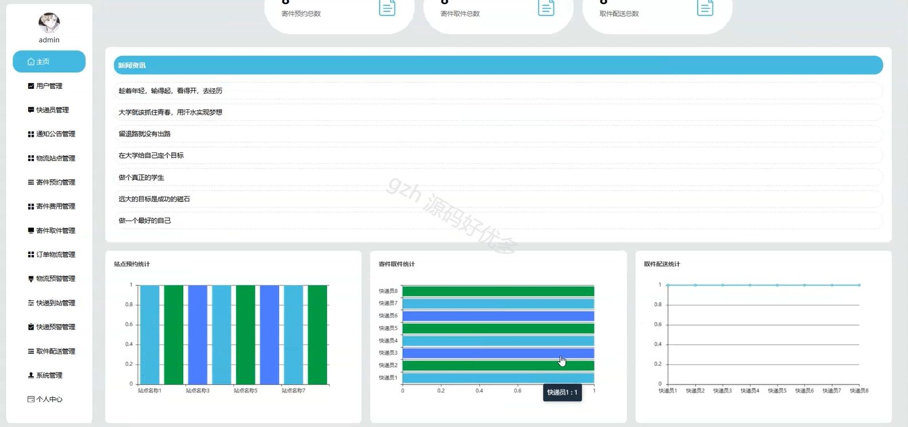
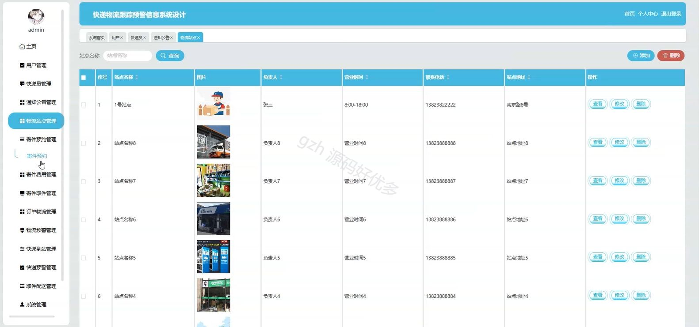
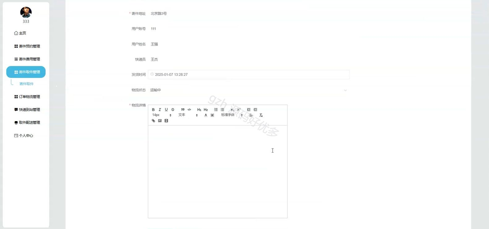

# springbootA398D
springbootA398D基于SpringBoot的物流跟踪系统
## 查看主页获取源码

### 一、关键词

物流站点管理、物流订单管理、物流预警管理

 

### 二、作品包含

源码+数据库+设计文档万字+全套环境和工具资源+部署教程

 

### 三、项目技术

前端技术：Html、Css、Js、Vue2.0、Element-ui 
后端技术：Java、SpringBoot2.0、MyBatis

  

 

### 四、运行环境（以下版本亲测，其他版本未知，请自测）

开发工具：IDEA/eclipse  + VSCODE

数据库：MySQL5.7（最低要5.7版本）

数据库管理工具：Navicat10以上版本

环境配置软件： JDK1.8 + Maven3.6.3

前端Nodejs：14

浏览器：谷歌浏览器

 

### 五、项目介绍

项目编号：springbootA398D

物流跟踪系统能够整合物流运输各环节数据，提升物流运作透明度与效率，优化各方决策与客户体验。

角色：管理员、用户、快递员

管理员：登录、主页、用户管理、快递员管理、通知公告管理、物流站点管理、寄件预约管理、寄件费用管理、寄件取件管理、订单物流管理、物流预警管理、快递到站管理、快递预警管理、取件配送管理、系统管理、个人中心。

用户：注册、登录、系统首页、通知公告、物流站点、新闻资讯、个人中心、修改密码、寄件预约、寄件费用、寄件取件、订单物流、物流预警、快递到站、快递预警、取件配送、我的收藏。

快递员：登录、主页、寄件预约管理、寄件费用管理、寄件取件管理、订单物流管理、快递到站管理、取件配送管理、个人中心。

 

### 六、运行截图

